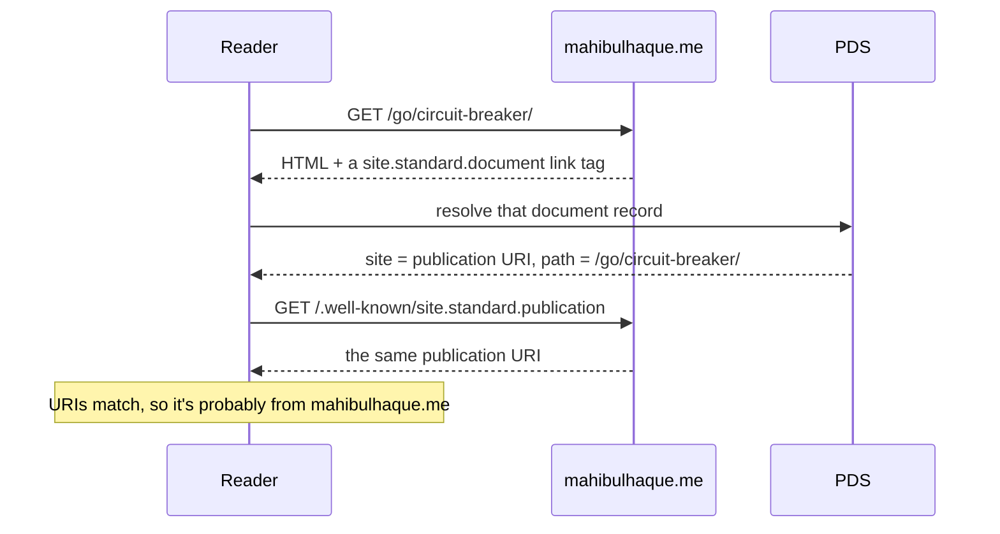

I put this blog on [standard.site]. Every post from now on also lives as a record on [ATProto] (the
protocol behind Bluesky), and new ones publish themselves whenever I [push to main].

## What it is

- [Standard.site](https://standard.site) - standard.site is a set of shared [ATProto lexicons]. The two that matter here are
  `site.standard.publication` and `site.standard.document`. The publication record describes
  the blog: name, URL, icon. Each post becomes a document record that lives in my own [data
  repository] on a [PDS] and points back at the publication. To prove the records are actually
  mine, there's a [/.well-known/site.standard.publication] file on my domain and a [link-rel
  tag] in every post's HTML pointing at the matching record. The two ends point at each other,
  with no central registry in between.
- [AT Protocol](https://atproto.com/) - As the site says, "The AT Protocol is an open, decentralized network for building social applications." In reality it's a bit more than that. It's a new way to publish content to the web that puts control back in the hands of users without sacrificing distrubtion.

<!-- prettier-ignore-start -->

<!-- prettier-ignore-end -->

## Why bother

Mostly the previews. Share one of my posts on Bluesky and the link turns into a card with
the title, description, and image instead of a bare URL. That works because the post is a
real record the network can read. Bluesky [shows richer previews] for standard.site links.

It goes past Bluesky, though. The records sit in my own PDS, so any reader can pick them up
on its own. [docs.surf] already lists my posts, and a search on [pckt] turns them up too.

It's cheap [POSSE] on top of that: mahibulhaque.me stays the canonical copy while a copy
syndicates out into the [ATmosphere].

## Setting it up with Sequoia

I didn't need to hand-roll any of the ATProto configuration. [Sequoia] is a CLI by Steve Simkins that does the whole thing for static sites. It doesn't much care what built yours ( Astro, Hugo, Eleventy) as long as it's Markdown. If you want to put your own blog on standard.site, it goes roughly like this.

First, you need a Bluesky account and an ATProto Identity (it can be created during the `sequoia init`) is the easy way to get one. The records live in your own PDS. Ownership is checked against a domain, so set your site's
domain as your handle (mine is `mahibulhaque.me`) and mint an app password for the CLI.

Then run `sequoia init` in the repo. It authenticates against your PDS, creates a
`site.standard.publication` record describing the blog (name, URL, icon), and scaffolds a
`sequoia.json`. That config is small: it points at your content directory and maps the
frontmatter fields it reads, like the publish date and the slug.

```json
{
  "siteUrl": "https://mahibulhaque.me",
  "contentDir": "./src/content/blogs",
  "imagesDir": "./src/assets/images",
  "outputDir": "./dist",
  "publicationUri": "at://did:plc:miwiepbo3e3sh5fknyt7jxqm/site.standard.publication/3mtgsuae5t22b",
  "frontmatter": {
    "publishDate": "date"
  },
  "publishContent": true,
  "bluesky": {
    "enabled": true,
    "maxAgeDays": 21
  }
}
```

That `publicationUri` is the `at://` address of the publication record `init` just made. The
same URI also lands in `static/.well-known/site.standard.publication`, so the domain and the
record name each other and the ownership check holds.

Each post's HTML also needs a `<link rel="site.standard.document">` pointing at that post's
record. `sequoia inject` can patch the tags into your built HTML; I emit them from my Hugo
`head` partial instead.

With that wired up, `sequoia publish` walks the content, creates a `site.standard.document`
record per post, and writes the resulting `atUri` back into each post's frontmatter. State
lives in `.sequoia-state.json`, so reruns only touch what actually changed.

## Making it hands-free

I didn't want to run `sequoia publish` by hand, so it happens in [CI] workflow. The job does a few things before creating Astro build:

- checks that every post has the same frontmatter keys in the same order
- sets `atprotoPath` from the filename
- stops the build if a post has the required fields, missing fields, or a wrong path
- copies the posts to a temporary Sequoia directory and adds the shared cover there
- asks Sequoia to publish only posts whose content changed
- writes Sequoia's returned `atUri` values and `.sequoia-state.json` back
- commits only those generated metadata changes with `[skip ci]`
- builds and deploys the Astro site

The blog publication flow didn't change: write Markdown and push to `main`. CI fills in the `atUri`, commits it back, and lets the deploy continue. This post turned into a `site.standard.document` the moment the deploy ran.

## Seeing it work

The previews are what I actually wanted. The card is just the record rendered, so I can put
a live, clickable one right here instead of a screenshot:
![bsky publication post][img_1]

That same post also exists as a record on [pdsls]. It has the title, description, path,
tags, and the full body.

![The same post as a site.standard.document record in pdsls][img_2]

If you want to copy the setup, it's all in the repo: [config], [script], and the [ci
workflow].

<!-- references -->
<!-- prettier-ignore-start -->

[standard.site]:
    https://standard.site

[atproto]:
    https://atproto.com

[atproto lexicons]:
    https://atproto.com/specs/lexicon

[data repository]:
    https://atproto.com/guides/data-repos

[pds]:
    https://atproto.com/guides/glossary#pds-personal-data-server

[/.well-known/site.standard.publication]:
    https://mahibulhaque.me/.well-known/site.standard.publication

[link-rel tag]:
    https://github.com/mahibulhaque/mahibulhaque.me/blob/main/src/layouts/Layout.astro

[shows richer previews]:
    https://atproto.com/blog/standard-site-bluesky-timeline

[posse]:
    https://indieweb.org/POSSE

[atmosphere]:
    https://atproto.com/blog/indexing-standard-site

[sequoia]:
    https://sequoia.pub

[ci]:
    https://github.com/mahibulhaque/mahibulhaque.me/blob/main/.github/workflows/ci.yml

[docs.surf]:
    https://docs.surf

[pckt]:
    https://pckt.blog/read?search=mahibulhaque

[pdsls]:
    https://pdsls.dev/at://did:plc:fgtm2c26vfcj74rfmeggbyqj/site.standard.document/3mnl6iapia32u

[push to main]:
    https://github.com/mahibulhaque/mahibulhaque.me

[config]:
    https://github.com/mahibulhaque/mahibulhaque.me/blob/main/sequoia.json

[script]:
    https://github.com/mahibulhaque/mahibulhaque.me/blob/main/scripts/frontmatter.ts

[ci workflow]:
    https://github.com/mahibulhaque/mahibulhaque.me/blob/main/.github/workflows/ci.yml

[small Go script]:
    https://github.com/mahibulhaque/mahibulhaque.me/blob/main/scripts/frontmatter.ts

[img_1]:
    https://blob.mahibulhaque.me/images/misc-atproto-standard-site-image-xGDe2kRu.webp

[img_2]:
    https://blob.mahibulhaque.me/images/misc-standard-site-image-c2KH8Y1L.webp
<!-- prettier-ignore-end -->
